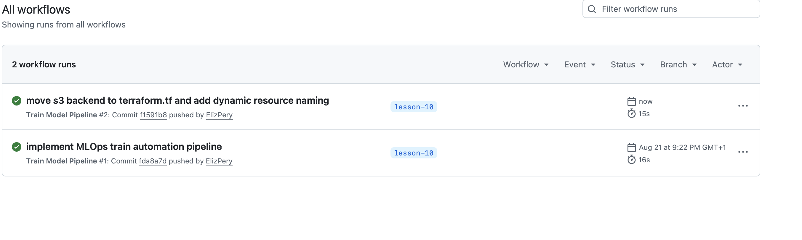

# MLOps AWS EKS & VPC Infrastructure

This repository contains Terraform code for automating the deployment of foundational AWS infrastructure tailored for ML workloads: a custom Virtual Private Cloud (VPC) and an Amazon EKS cluster featuring isolated node groups for CPU and GPU workloads.

---

## Repository Structure

```text
eks-vpc-cluster/
├── vpc/
│   ├── main.tf
│   ├── variables.tf
│   ├── outputs.tf
│   ├── terraform.tf
│   └── backend.tf
├── eks/
│   ├── main.tf
│   ├── variables.tf
│   ├── outputs.tf
│   ├── terraform.tf
│   ├── backend.tf
│   └── data.tf
├── .gitignore
└── README.md
```

---

## Architecture Overview

- **VPC Module**: Uses the official `terraform-aws-modules/vpc/aws` module to create public/private subnets across multiple Availability Zones, a NAT Gateway for outbound internet access from private subnets, and essential Kubernetes subnet tags for load balancer auto-discovery.

- **Terraform Remote State**: The eks/ configuration reads outputs directly from the `vpc/` state file using data `"terraform_remote_state" "vpc"`, maintaining strict decoupling between network and cluster management.

- **Workload-Isolated Node Groups**:

    - `cpu-nodes`: Standard compute nodes (t3.small) designated for controllers, monitoring, and standard microservices.

    - `gpu-nodes`: Workload-isolated node group. For lab/educational environments, this is configured with cost-effective Spot instances (t3.small).

---

## Prerequisites

Before deploying, ensure you have installed and configured:

1. **CLI Tools**:
- Terraform (>= 1.5.0)
- AWS CLI v2
- kubectl

2. **AWS Credentials**: Configured via `aws configure` or environment variables (`AWS_ACCESS_KEY_ID`, `AWS_SECRET_ACCESS_KEY`, `AWS_REGION`).

3. **S3 Backend Bucket**: An existing S3 bucket in your AWS account to store Terraform state files (configured as `mlops-tfstate-training` in `backend.tf`).

---

## Deployment Steps

### Step 1: Deploy Network Infrastructure (VPC)

Navigate to the `vpc/` directory, initialize Terraform and apply the configuration:

```bash
cd vpc

# Initialize backend and providers
terraform init

# Review and apply resources
terraform plan
terraform apply
```

Verify that the outputs (`vpc_id`, `private_subnets`, `public_subnets`) are displayed in the terminal upon completion.

### Step 2: Deploy Kubernetes Cluster (EKS)

Navigate to the `eks/` directory, initialize Terraform and provision the cluster:

```bash
cd ../eks

# Initialize backend and providers
terraform init

# Review and apply resources
terraform plan
terraform apply
```

---

## Connecting & Verifying the Cluster

1. Update your local `kubeconfig`:

```bash
aws eks --region us-east-1 update-kubeconfig --name mlops-eks-cluster --profile devops-course
```

2. Verify node status:

```bash
kubectl get nodes -o wide
```
All nodes should report a status of `Ready`.

3. Check node group separation:

```bash
# List CPU workload nodes
kubectl get nodes -l workload=cpu

# List GPU workload nodes
kubectl get nodes -l workload=gpu
```

4. Verify node taints on GPU nodes:

```bash
kubectl describe nodes -l workload=gpu | grep Taints
```
Output should display: `Taints: nvidia.com/gpu=true:NoSchedule`.

---

## Resource Teardown

To avoid incurring unnecessary cloud expenses, destroy the resources when testing is complete. **Order matters**: you must destroy the EKS cluster prior to destroying the VPC.

```bash
# Step 1: Destroy EKS Cluster and Node Groups
cd eks
terraform destroy

# Step 2: Destroy VPC Infrastructure
cd ../vpc
terraform destroy
```

## Screenshot expected outcome

