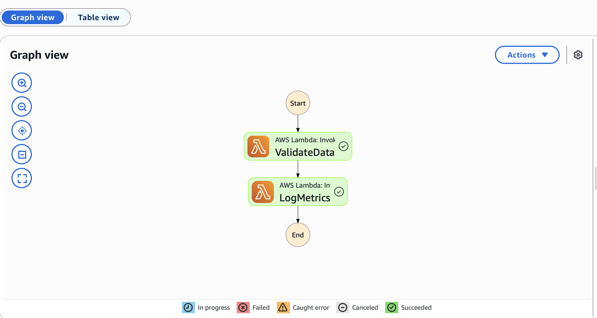

# MLOps Training Automation with AWS Step Functions & GitHub Actions

This repository implements an automated Machine Learning (ML) model training workflow using **AWS Step Functions**, **AWS Lambda**, **Terraform**, and **GitHub Actions**.

---

## Architecture Overview

The serverless orchestration workflow consists of two sequential steps:
1. **ValidateData**: Triggers the `validate.py` Lambda function to verify input data integrity.
2. **LogMetrics**: Triggers the `log_metrics.py` Lambda function to register pipeline execution results and metrics.

---

## Project Structure

```text
mlops-train-automation/
├── .github/
│   └── workflows/
│       └── train.yml
├── terraform/
│   ├── main.tf
│   ├── data.tf
│   ├── terraform.tf
│   ├── variables.tf
│   └── lambda/
│       ├── validate.py
│       ├── log_metrics.py
│       ├── validate.zip
│       └── log_metrics.zip
└── README.md
```

---

## 1. Preparing Lambda Deployment Packages

Before provisioning infrastructure with Terraform, package the Python source files into `.zip` archives:

```bash
cd terraform/lambda
zip validate.zip validate.py
zip log_metrics.zip log_metrics.py
cd ../..
```

## 2. Infrastructure Deployment (Terraform)

1. Navigate to the `terraform/` directory:

```bash
cd terraform
```

2. Initialize Terraform modules and providers:

```bash
terraform init
```

3. Review the proposed infrastructure changes:

```bash
terraform plan
```

4. Deploy resources to AWS:

```bash
terraform apply
```

5. Copy the `step_function_arn` value displayed in the Terraform output.

## 3. Manual Verification via AWS Console

1. Open the **AWS Management Console** and navigate to **Step Functions**.
2. Select the State Machine named **MLOpsPipeline**.
3. Click Start execution.
4. Pass the following sample input JSON payload:

```text
{
  "source": "manual-test",
  "commit": "a1b2c3d"
}
```

5. Confirm that both steps (`ValidateData` → `LogMetrics`) complete with a status of Succeeded.

## 4. CI/CD Integration (GitHub Actions)

### Required GitHub Secrets

In your GitHub repository, navigate to **Settings** → **Secrets and variables** → **Actions** and configure the following encrypted secrets:

- `AWS_ACCESS_KEY_ID`: IAM Access Key ID with permissions to execute Step Functions;
- `AWS_SECRET_ACCESS_KEY`: IAM Secret Access Key;
- `AWS_REGION`: AWS Deployment Region (e.g., us-east-1);
- `STEP_FUNCTION_ARN`: ARN of the deployed Step Function (from terraform output).

### Automated Pipeline Payload

When triggered on `push`, GitHub Actions automatically invokes the Step Function with the following payload structure:

```text
{
  "source": "github-actions",
  "commit": "4f8a12b"
}
```

## 5. Resource Teardown

To avoid incurring unnecessary cloud expenses, destroy the resources when testing is complete.

```bash
terraform destroy
```

## Screenshots


