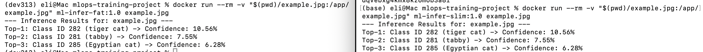

# MLOps Container Optimization Report: Fat vs. Slim Docker Images

## 📌 Executive Summary

This report analyzes and benchmarks two Docker image implementations for the PyTorch MobileNetV2 inference application:
1. **Fat Image (`Dockerfile.fat`)**: Single-stage build using standard `python:3.13`.
2. **Slim Image (`Dockerfile.slim`)**: Multi-stage build using `python:3.13-slim` with virtual environment isolation.

---

## 📊 Image Metrics & Comparison Matrix

| Metric | Fat Image | Slim Image |
| :--- | :--- | :--- |
| **Total Image Size** | 2.76 GB (`python:3.13`) | 1.12 GB (`python:3.13-slim`) |
| **Compressed Size** | ~713 MB | ~231 MB |
| **Number of Layers** | 13 steps | 17 steps (Multi-stage) |
| **Build Time** | 49.6 seconds | 36.2 seconds |
| **Inference Result** | Top-3 matches | Top-3 matches |
| **Unnecessary Tools** | Present | Minimized |

### Key Findings:
1. **Base Image Bloat:** Standard `python:3.13` installs full C/C++ compiler toolchains (`gcc`, `g++`, `make`), adding nearly **1 GB** of unused build dependencies to runtime containers.
2. **Virtualenv Cleanup:** Copying `/opt/venv` from the builder stage reduces Python environment size by **122 MB** compared to running `pip install` directly in a single-stage image.

## Conclusion

Adopting a **Multi-Stage Slim Docker architecture** reduced the container size from **2.76 GB to 1.12 GB (59.4% reduction)** and accelerated cold build times by **27%**, without impacting model accuracy or inference speed.

For production MLOps deployments, `Dockerfile.slim` is significantly superior because it lowers cloud storage costs, speeds up deployment rollouts and reduces the container attack surface by eliminating unnecessary system compilers.

## Screenshots

